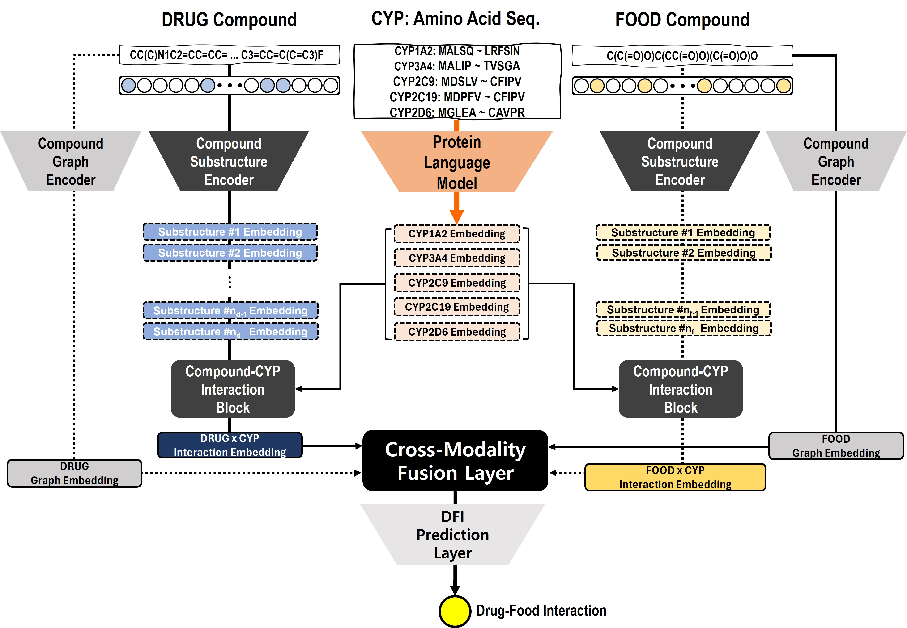

# ArcDFI: Attention Regularization guided by CYP450 Interactions for Predicting Drug-Food Interactions

## Abstract

Drug-food interactions are an integral part of health and safety especially when consuming certain foods during drug treatment. They are characterized by situations where foods consisting of various small food compounds alter the pharmacokinetics or pharmacodynamics of a drug compound. Especially, it is known that CYP450 enzyme families play a key role in explaining drug-food interactions (DFIs). Previous works have introduced computational approaches for predicting DFIs but lack incorporation of drug-CYP interaction (DCI) information and also have limited generalizability in drug or food compounds unseen during model training. In this paper, we introduce ArcDFI, a model that utilizes Attention Regularization guided by CYP450 Interactions for predicting Drug-Food Interactions. Our experiments conducted on stricter evaluation settings (cold drug and cold food) show ArcDFI's strong generalizability in both unseen drug and food compounds, compared with other baseline models. Analysis on ArcDFI's cross attention mechanism between the CYP450 isoenzymes and compound substructures provides insights of its current understanding of DCIs that lead to explaining its rationale behind DFI predictions. Although the attention regularization method helps ArcDFI develop its understanding of DCIs, we conclude that expanding the DCI interactions and gathering additional data can further improve ArcDFI's predictability and interpretability.

## Contributors

<table>
	<tr>
		<th>Name</th>		
		<th>Affiliation</th>
		<th>Email</th>
	</tr>
	<tr>
		<td>Mogan Gim&dagger;</td>		
		<td>Department of Biomedical Engineering, Hankuk University of Foreign Studies, Yongin, South Korea</td>
		<td>gimmogan@hufs.ac.kr</td>
	</tr>
	<tr>
		<td>Donghyeon Park&dagger;</td>		
		<td>Department of AI and Data Science, Sejong University, Seoul, South Korea</td>
		<td>juns94@sejong.ac.kr</td>
	</tr>
	<tr>
		<td>Jaewoo Kang</td>		
		<td>Department of Computer Science, Korea University, Seoul, South Korea</td>
		<td>kangj@korea.ac.kr</td>
	</tr>
	<tr>
		<td>Minji Jeon*</td>		
		<td>Department of Biomedical Informatics, Department of Medicine, Korea University College of Medicine, Seoul, South Korea</td>
		<td>mjjeon@korea.ac.kr</td>
	</tr>
</table>

- &dagger;: *Equal Contributors*
- &ast;: *Corresponding Author*