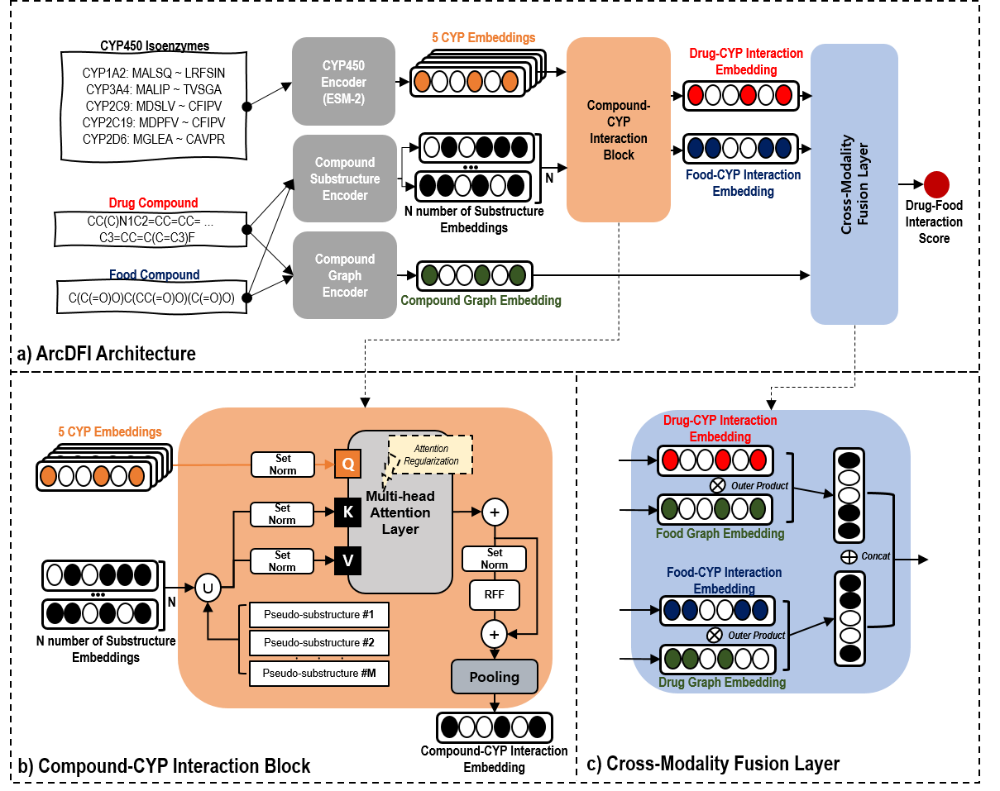

# ArcDFI: Attention Regularization guided by CYP450 Interactions for Predicting Drug-Food Interactions



## Abstract

Drug-food interactions are an integral part of health and safety especially when consuming certain foods during drug treatment. They are characterized by situations where foods consisting of various small food compounds alter the pharmacokinetics or pharmacodynamics of a drug compound. Especially, it is known that CYP450 enzyme families play a key role in explaining drug-food interactions (DFIs). Previous works have introduced computational approaches for predicting DFIs but lack incorporation of drug-CYP interaction (DCI) information and also have limited generalizability in drug or food compounds unseen during model training. In this paper, we introduce ArcDFI, a model that utilizes Attention Regularization guided by CYP450 Interactions for predicting Drug-Food Interactions. Our experiments conducted on stricter evaluation settings (cold drug and cold food) show ArcDFI's strong generalizability in both unseen drug and food compounds, compared with other baseline models. Analysis on ArcDFI's cross attention mechanism between the CYP450 isoenzymes and compound substructures provides insights of its current understanding of DCIs that lead to explaining its rationale behind DFI predictions. Although the attention regularization method helps ArcDFI develop its understanding of DCIs, we conclude that expanding the DCI interactions and gathering additional data can further improve ArcDFI's predictability and interpretability.

# Required Libraries

Install the following external libraries to run this project:

```text
deepchem
matplotlib
numpy
omegaconf
pandas
rdkit
scikit-learn
scipy
seaborn
torch
torch_geometric
```

## Download Instructions

To run the model and reproduce results, please download the following files from Google Drive:

1. **Model Checkpoint**  
   File: `arcdfi.ckpt`  
   [Download Link](https://drive.google.com/file/d/1yVcO_O6pYbCtTGxQjwwWD550okSmhizr/view?usp=sharing)

2. **DFI Dataset**  
   File: `dfi_final.csv`  
   [Download Link](https://drive.google.com/file/d/1TAr6v1Swfn4F_O_GyKKQf6KlsWh8lQ5N/view?usp=sharing)

After downloading, place the files in the appropriate directories:
```bash
├── data/
│   └── dfi_240901.csv
├── checkpoints/
│   └── arcdfi.ckpt
```

As stated in our paper, we release both Drug-Food Interaction and Drug-CYP450 Interaction dataset. The dataset zip file from the Google Drive contains both Drug-Food Interaction Dataset `dfi_final.csv` and Drug-CYP450 Interaction Dataset `dci_final.csv`. Only the `dfi_final.csv` file is needed for the model training process. 

## Model Training Instructions

Simply run the following command,

```bash
python train.py -cn arcdfi -pn <wandb_project_name> -gn <wandb_group_name> -sn <wandb_session_name> -ds <newdrug_or_newfood>
```

## Attention Weights Analysis


You can also reproduce the visualization results of the attention weights by running the Jupyter Notebook `ArcDFI Analysis.ipynb`. Make sure that the downloaded files are in the correct directories.


## Contributors

<table>
	<tr>
		<th>Name</th>		
		<th>Affiliation</th>
		<th>Email</th>
	</tr>
	<tr>
		<td>Mogan Gim</td>		
		<td>Department of Biomedical Engineering,<br>Hankuk University of Foreign Studies, Yongin, South Korea</td>
		<td>gimmogan@hufs.ac.kr</td>
	</tr>
	<tr>
		<td>Jaewoo Kang</td>		
		<td>Department of Computer Science,<br>Korea University, Seoul, South Korea</td>
		<td>kangj@korea.ac.kr</td>
	</tr>	
	<tr>
		<td>Donghyeon Park*</td>		
		<td>Department of AI and Data Science,<br>Sejong University, Seoul, South Korea</td>
		<td>parkdh@sejong.ac.kr</td>
	</tr>
	<tr>
		<td>Minji Jeon*</td>		
		<td>Department of Biomedical Informatics, Department of Medicine,<br>Korea University College of Medicine, Seoul, South Korea</td>
		<td>mjjeon@korea.ac.kr</td>
	</tr>
</table>

- &ast;: *Co-corresponding Authors*